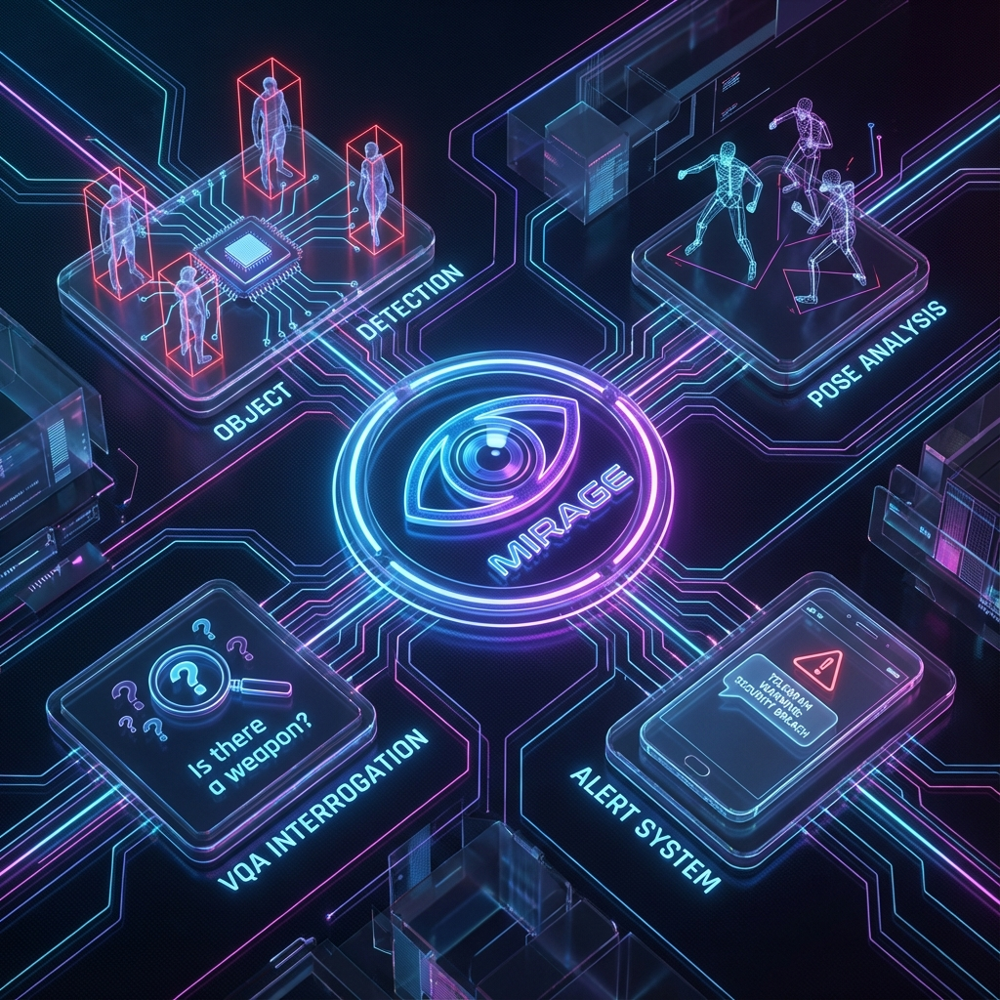

# 👁️ AI Surveillance Camera: The Digital Guardian


> *"In a world where 99% of surveillance footage is only watched **after** a tragedy has occurred, we asked a simple question: What if the camera could scream?"*

## 💡 The Idea Behind


This project stems from a critical realization: **Passive surveillance is obsolete.** Traditional cameras are merely "black boxes" that record crimes as they happen, offering no intervention. 

Our vision, visualized above, was to create a **Proactive Safety Agent**. Instead of just storing pixels, the **AI Surveillance Camera** deconstructs reality into data streams—Pose, Objects, and Context—and reassembles them to understand *intent*. It transforms the camera from a passive observer into an active guardian capable of identifying danger *before* it escalates.

## 🚀 Update: Integrating Visual Question Answering (VQA)
Safety isn't black and white; it's nuanced. To tackle this, we have now integrated a massive **Visual Question Answering (VQA)** engine.
*   **Old Way**: "Is there a person?" (Yes/No)
*   **New Way**: The system now asks over **1,600+ contextual questions** per frame, such as:
    *   *"Is the person holding a weapon?"*
    *   *"Is the victim cornered?"*
    *   *"Is the gesture aggressive or friendly?"*
    *   *"Is there blood on the floor?"*
    
This VQA layer allows the system to "reason" about the scene, reducing false positives and providing a detailed text-based justification for every alert it triggers.

---

## 📖 The Story

Imagine walking home alone at night. The streets are empty, shadows are long, and a sense of unease settles in. You pass a CCTV camera, its red light blinking. You think you are safe. **You are not.** That camera is recording your potential fate, not preventing it. It is a passive observer, a silent witness to history.

**We are changing that.**

We have built the **AI Surveillance Camera**—a system that acts like a hyper-vigilant sentry. For every single frame of video, it doesn't just look; it **interrogates**. It builds a psychological profile of the scene in real-time, instantly detecting anomalies, violence, and distress, and alerting authorities *before* the first blow lands.

---

## 🧠 How It Works: The "1000-Question" Engine

### 1. The Interrogation (VQA)
Using a fine-tuned Vision-Language Transformer (ViLT), the system mathematically generates a matrix of over 1000 hypotheses for every frame, covering:
*   **Violence:** Punching, kicking, strangling, shooting.
*   **Weapons:** Guns, knives, bats, makeshift weapons.
*   **Context:** Screaming, panic, chasing, dark alleyways.

### 2. The Logic (Behavioral Analysis)
We combine:
*   **YOLOv8** for rapid object tracking.
*   **MediaPipe Pose** to calculate aggressive body angles (attack stances vs. surrender).
*   **Gender-Safety Algorithms** to identify high-risk scenarios.

### 3. The Intervention
If the "Risk Score" breaches our safety threshold, the system:
1.  **Locks Target**: Tracking the aggressor.
2.  **Generates Evidence**: Captures high-res snapshots.
3.  **Screams**: Instantly dispatches a Telegram alert with photos and a generated situation report.

---

## 🛠️ Technology Stack

*   **Deep Learning**: HuggingFace Transformers (ViLT), TensorFlow, PyTorch.
*   **Computer Vision**: OpenCV, Ultralytics YOLOv8, MediaPipe.
*   **Logic Core**: Custom combinatorial VQA engine (1,600+ weighted questions).
*   **Reporting**: Automated incident description using GPT-2.

---

## 💰 Support The Project

**This project is self-funded and open-source.**

We are looking for collaborators and supporters to help us deploy this on edge devices (Raspberry Pi/Jetson Nano) and bring it to the real world.

**Contact me directly to support or collaborate:**
📧 **Email**: [manamnathtiwari@gmail.com](mailto:manamnathtiwari@gmail.com)

---

### 💻 Installation & Usage

1. **Clone the repo**
   ```bash
   git clone https://github.com/manamnathtiwari/AI-Surveillance-Camera.git
   ```
2. **Install Dependencies**
   ```bash
   pip install -r requirements.txt
   ```
3. **Run the Dashboard**
   ```bash
   streamlit run run.py
   ```


---
*Created with ❤️ and ☕ by Manamnath Tiwari.*
